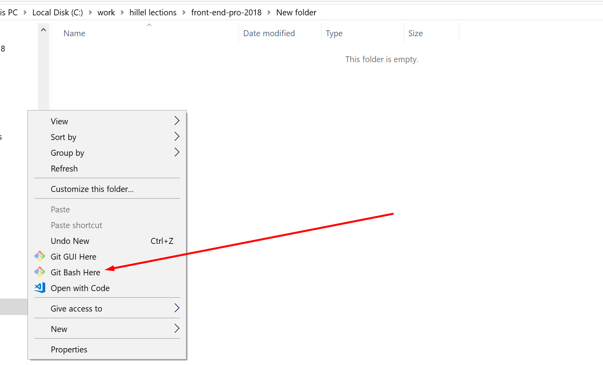

# front-end-pro-2018-march

## Базовая работа с репозиторием

1) скачать и установить git: https://git-scm.com/book/ru/v1/%D0%92%D0%B2%D0%B5%D0%B4%D0%B5%D0%BD%D0%B8%D0%B5-%D0%A3%D1%81%D1%82%D0%B0%D0%BD%D0%BE%D0%B2%D0%BA%D0%B0-Git
 
2) Открыть Git Bash (консоль) в новой папке
 
 

3) выполнить команду 
 
    `git clone https://github.com/hillel-front-end/front-end-pro-2018.git`

4) перейти в папку проекта

    `cd front-end-pro-2018`

# Обновление репозитория

1) Находясь в корне проекта ввести команду

    `git pull origin master`