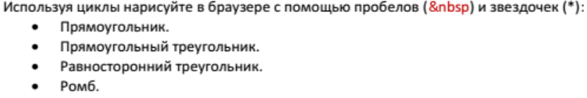

# Изучить материал

* https://developer.mozilla.org/en-US/docs/Web/JavaScript/Guide/Loops_and_iteration
* https://developer.mozilla.org/ru/docs/Web/JavaScript/Guide/Expressions_and_Operators
* https://learn.javascript.ru/ifelse
* https://learn.javascript.ru/switch

# Практика

1. 

2. a и b вводятся с клавиатуры (числа). Каждое число от a до b вывести в квадрате с сохранением знака.

        -3, -2, -1, 0, 1, 2 
            -> 
        -9, -4, -1, 0, 1, 4 

# Лекция

1. Дано `a = 1, b = 15;`. Вывести на экран таблицу, которая будет состоять из 2-ух рядков. В 1-ом рядке - нечетные числа: `13579111315`, в 2-ом - четные: `2468101214`

2. Ввести с клавиатуры числа `x, y` (заставить пользователя ввести числа). Запустить цикл перебора от `x` до `y` (вне зависимости от значений)!. Посчитать сумму парных чисел если `x > y`, непарных если `x < y`;